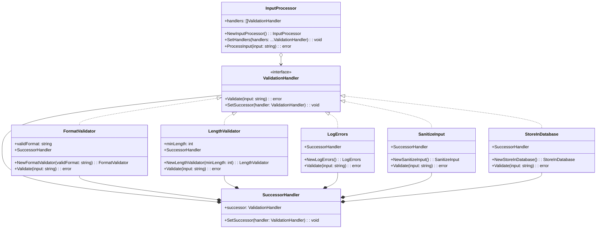
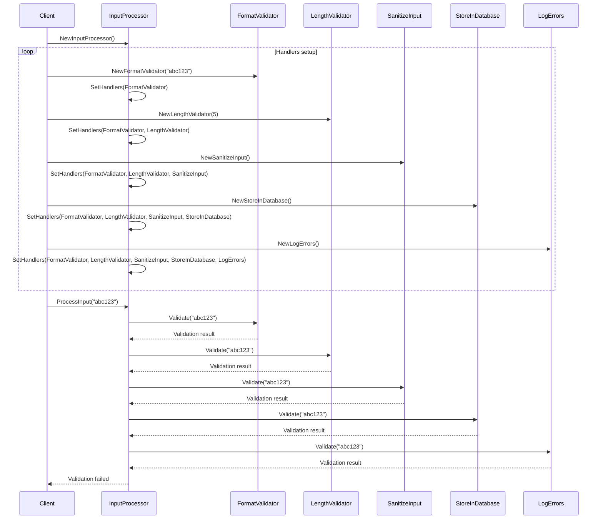

# Chain Of Responsibility

### Class Diagram

```mermaid
classDiagram
  class FormatValidator {
    +validFormat: string
    +SuccessorHandler
    +NewFormatValidator(validFormat: string): FormatValidator
    +Validate(input: string): error
  }

  class InputProcessor {
    +handlers: []ValidationHandler
    +NewInputProcessor(): InputProcessor
    +SetHandlers(handlers: ...ValidationHandler): void
    +ProcessInput(input: string): error
  }

  class LengthValidator {
    +minLength: int
    +SuccessorHandler
    +NewLengthValidator(minLength: int): LengthValidator
    +Validate(input: string): error
  }

  class LogErrors {
    +SuccessorHandler
    +NewLogErrors(): LogErrors
    +Validate(input: string): error
  }

  class SanitizeInput {
    +SuccessorHandler
    +NewSanitizeInput(): SanitizeInput
    +Validate(input: string): error
  }

  class StoreInDatabase {
    +SuccessorHandler
    +NewStoreInDatabase(): StoreInDatabase
    +Validate(input: string): error
  }

  class SuccessorHandler {
    +successor: ValidationHandler
    +SetSuccessor(handler: ValidationHandler): void
  }

  class ValidationHandler {
    <<interface>>
    +Validate(input: string): error
    +SetSuccessor(handler: ValidationHandler): void
  }

  ValidationHandler <|.. FormatValidator
  ValidationHandler <|.. LengthValidator
  ValidationHandler <|.. LogErrors
  ValidationHandler <|.. SanitizeInput
  ValidationHandler <|.. StoreInDatabase
  InputProcessor o--> ValidationHandler

   ValidationHandler --* SuccessorHandler
    FormatValidator --* SuccessorHandler
    LengthValidator --* SuccessorHandler
    LogErrors --* SuccessorHandler
    SanitizeInput --* SuccessorHandler
    StoreInDatabase --* SuccessorHandler
```

### Sequence Diagram

```mermaid
sequenceDiagram
  participant Client
  participant InputProcessor
  participant FormatValidator
  participant LengthValidator
  participant SanitizeInput
  participant StoreInDatabase
  participant LogErrors

  Client ->> InputProcessor: NewInputProcessor()
  loop Handlers setup
    Client ->> FormatValidator: NewFormatValidator("abc123")
    InputProcessor ->> InputProcessor: SetHandlers(FormatValidator)
    Client ->> LengthValidator: NewLengthValidator(5)
    InputProcessor ->> InputProcessor: SetHandlers(FormatValidator, LengthValidator)
    Client ->> SanitizeInput: NewSanitizeInput()
    InputProcessor ->> InputProcessor: SetHandlers(FormatValidator, LengthValidator, SanitizeInput)
    Client ->> StoreInDatabase: NewStoreInDatabase()
    InputProcessor ->> InputProcessor: SetHandlers(FormatValidator, LengthValidator, SanitizeInput, StoreInDatabase)
    Client ->> LogErrors: NewLogErrors()
    InputProcessor ->> InputProcessor: SetHandlers(FormatValidator, LengthValidator, SanitizeInput, StoreInDatabase, LogErrors)
  end

  Client ->> InputProcessor: ProcessInput("abc123")
  InputProcessor ->> FormatValidator: Validate("abc123")
  FormatValidator -->> InputProcessor: Validation result
  InputProcessor ->> LengthValidator: Validate("abc123")
  LengthValidator -->> InputProcessor: Validation result
  InputProcessor ->> SanitizeInput: Validate("abc123")
  SanitizeInput -->> InputProcessor: Validation result
  InputProcessor ->> StoreInDatabase: Validate("abc123")
  StoreInDatabase -->> InputProcessor: Validation result
  InputProcessor ->> LogErrors: Validate("abc123")
  LogErrors -->> InputProcessor: Validation result
  InputProcessor -->> Client: Validation failed

```
