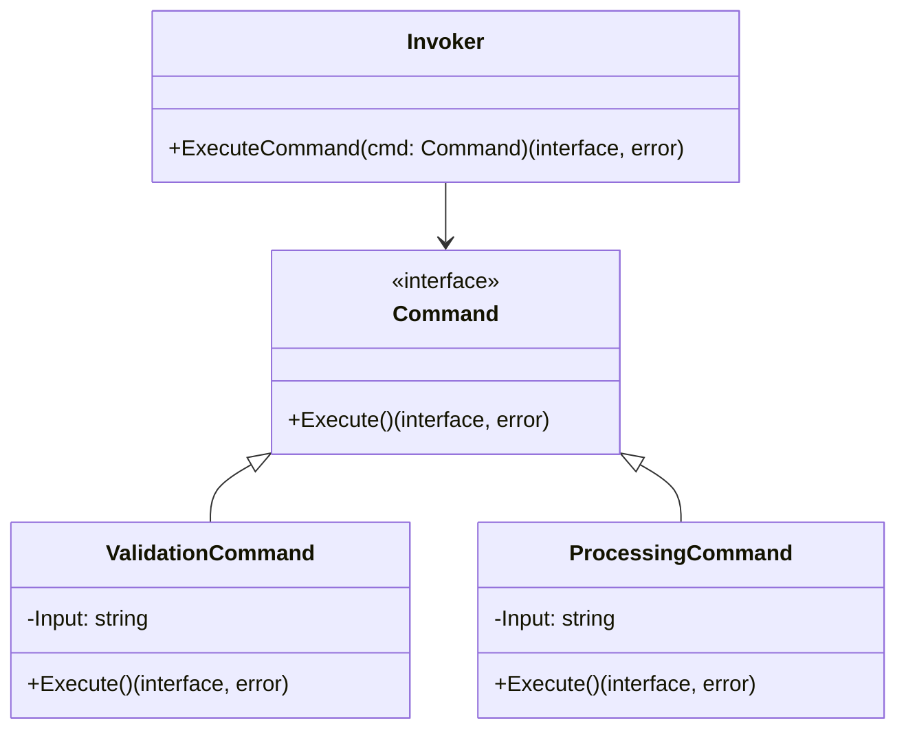
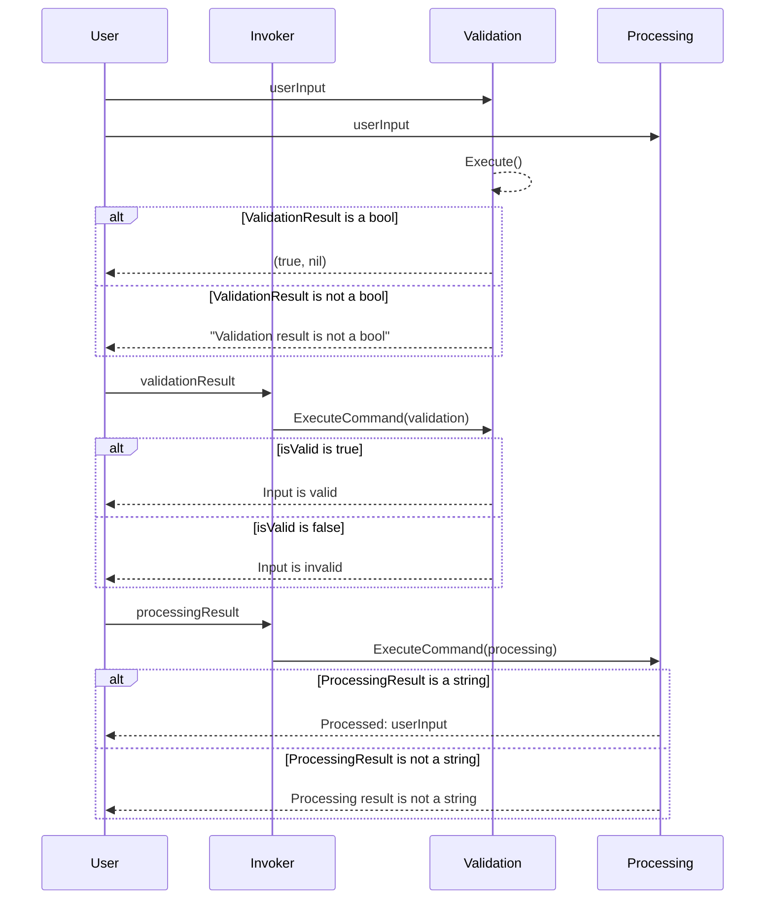

# Command Design Pattern

### Class Diagram

```mermaid
classDiagram
    class Command {
        <<interface>>
        +Execute() (interface, error)
    }
    class ValidationCommand {
        -Input: string
        +Execute() (interface, error)
    }
    class ProcessingCommand {
        -Input: string
        +Execute() (interface, error)
    }
    class Invoker {
        +ExecuteCommand(cmd: Command) (interface, error)
    }

    Command <|-- ValidationCommand
    Command <|-- ProcessingCommand
    Invoker --> Command

```

### Sequence Diagram

```mermaid
sequenceDiagram
    participant User
    participant Invoker
    participant Validation
    participant Processing

    User ->> Validation: userInput
    User ->> Processing: userInput

    Validation -->> Validation: Execute()
    alt ValidationResult is a bool
        Validation -->> User: (true, nil)
    else ValidationResult is not a bool
        Validation -->> User: "Validation result is not a bool"
    end

    User ->> Invoker: validationResult
    Invoker ->> Validation: ExecuteCommand(validation)

    alt isValid is true
        Validation -->> User: Input is valid
    else isValid is false
        Validation -->> User: Input is invalid
    end

    User ->> Invoker: processingResult
    Invoker ->> Processing: ExecuteCommand(processing)

    alt ProcessingResult is a string
        Processing -->> User: Processed: userInput
    else ProcessingResult is not a string
        Processing -->> User: Processing result is not a string
    end
```
