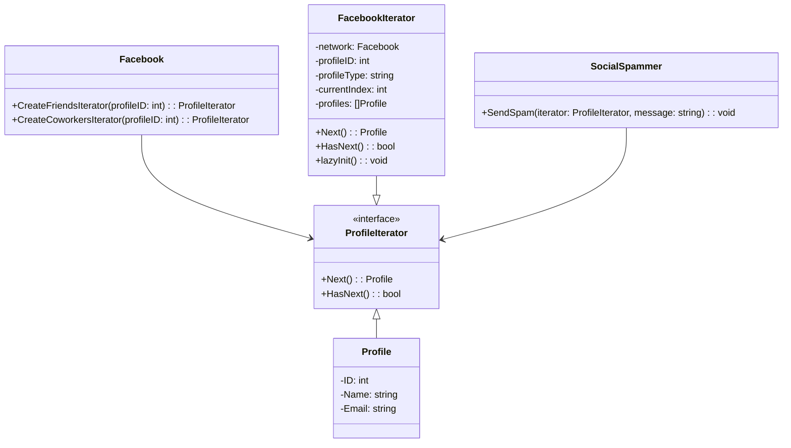
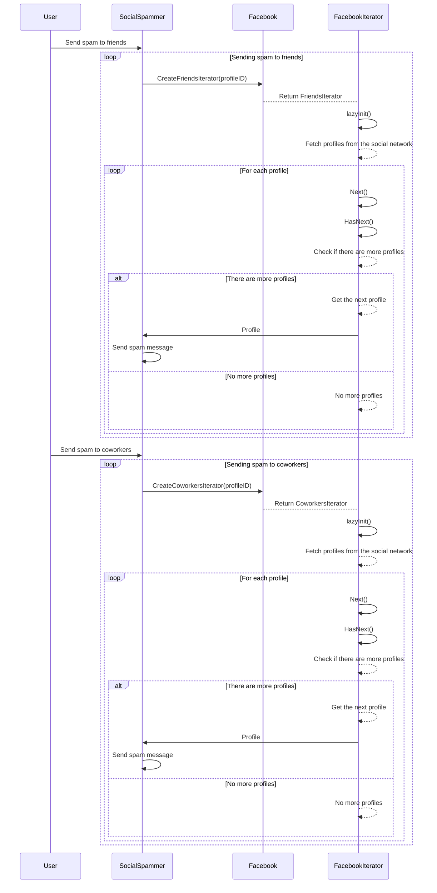

# Iterator Pattern

### Class Diagram

```mermaid
classDiagram
    class Profile {
        -ID: int
        -Name: string
        -Email: string
    }

    class ProfileIterator {
        <<interface>>
        +Next(): Profile
        +HasNext(): bool
    }

    class Facebook {
        +CreateFriendsIterator(profileID: int): ProfileIterator
        +CreateCoworkersIterator(profileID: int): ProfileIterator
    }

    class FacebookIterator {
        -network: Facebook
        -profileID: int
        -profileType: string
        -currentIndex: int
        -profiles: []Profile
        +Next(): Profile
        +HasNext(): bool
        +lazyInit(): void
    }

    class SocialSpammer {
        +SendSpam(iterator: ProfileIterator, message: string): void
    }

    ProfileIterator <|-- Profile
    Facebook --> ProfileIterator
    FacebookIterator --|> ProfileIterator
    SocialSpammer --> ProfileIterator

```

### Sequence Diagram

```mermaid
sequenceDiagram
    participant User
    participant SocialSpammer
    participant Facebook
    participant FacebookIterator

    User ->> SocialSpammer: Send spam to friends
    loop Sending spam to friends
        SocialSpammer ->> Facebook: CreateFriendsIterator(profileID)
        Facebook --> FacebookIterator: Return FriendsIterator
        FacebookIterator ->> FacebookIterator: lazyInit()
        FacebookIterator -->> FacebookIterator: Fetch profiles from the social network
        loop For each profile
            FacebookIterator ->> FacebookIterator: Next()
            FacebookIterator ->> FacebookIterator: HasNext()
            FacebookIterator -->> FacebookIterator: Check if there are more profiles
            alt There are more profiles
                FacebookIterator -->> FacebookIterator: Get the next profile
                FacebookIterator ->> SocialSpammer: Profile
                SocialSpammer ->> SocialSpammer: Send spam message
            else No more profiles
                FacebookIterator -->> FacebookIterator: No more profiles
            end
        end
    end

    User ->> SocialSpammer: Send spam to coworkers
    loop Sending spam to coworkers
        SocialSpammer ->> Facebook: CreateCoworkersIterator(profileID)
        Facebook --> FacebookIterator: Return CoworkersIterator
        FacebookIterator ->> FacebookIterator: lazyInit()
        FacebookIterator -->> FacebookIterator: Fetch profiles from the social network
        loop For each profile
            FacebookIterator ->> FacebookIterator: Next()
            FacebookIterator ->> FacebookIterator: HasNext()
            FacebookIterator -->> FacebookIterator: Check if there are more profiles
            alt There are more profiles
                FacebookIterator -->> FacebookIterator: Get the next profile
                FacebookIterator ->> SocialSpammer: Profile
                SocialSpammer ->> SocialSpammer: Send spam message
            else No more profiles
                FacebookIterator -->> FacebookIterator: No more profiles
            end
        end
    end

```
