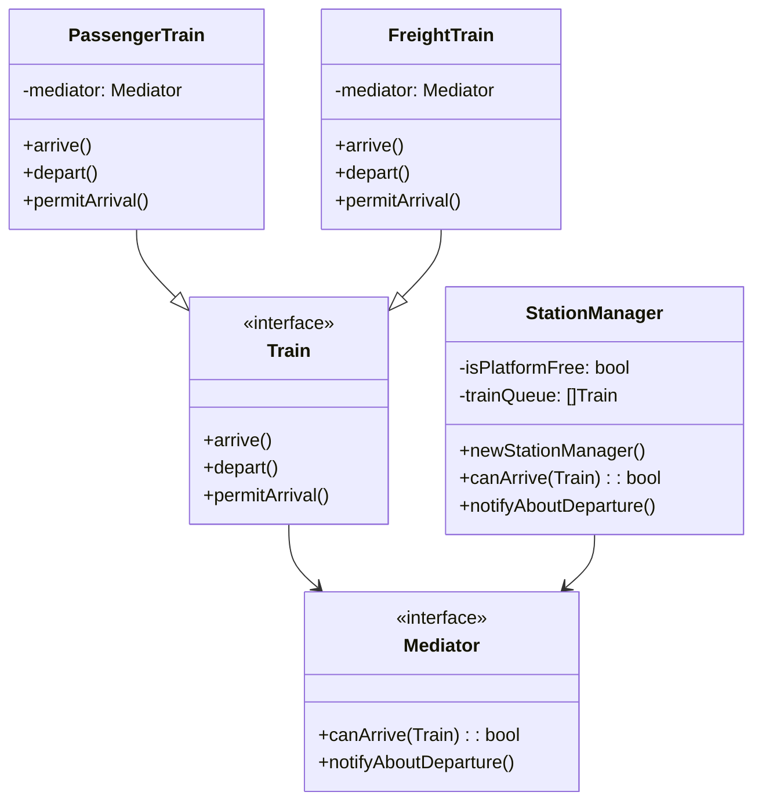
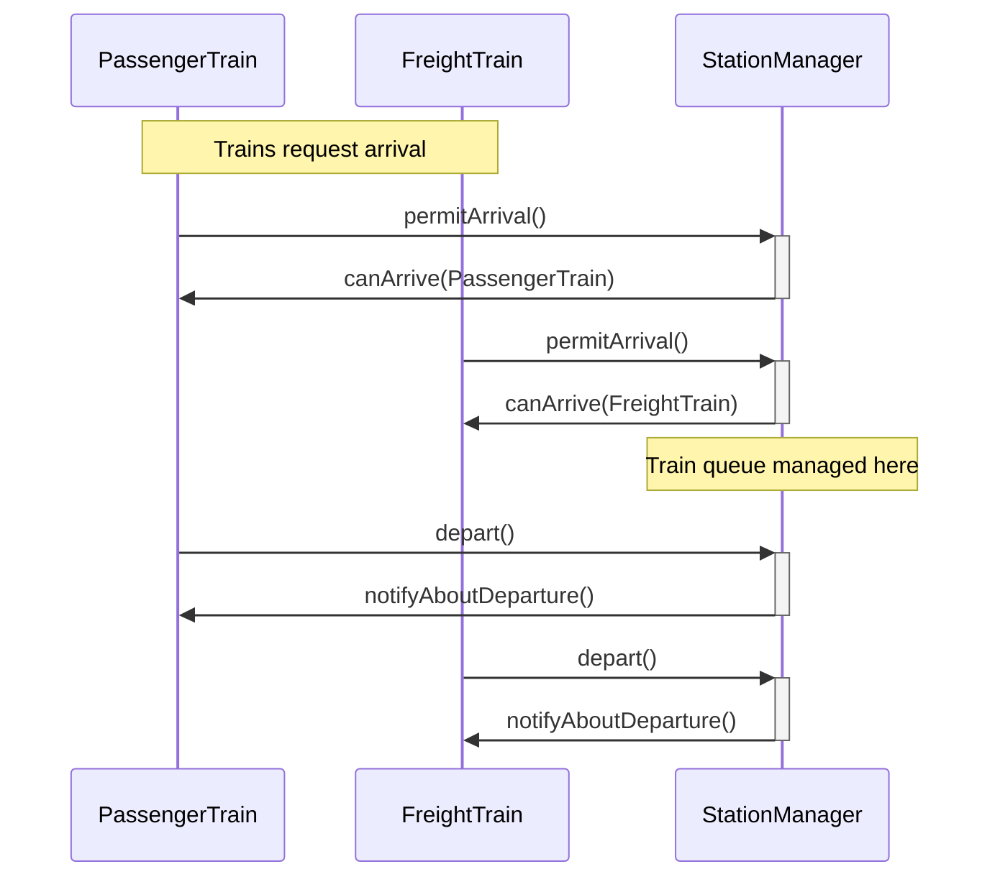

# Mediator Design Pattern

### Class Diagram

```mermaid
classDiagram
    class Train {
        <<interface>>
        +arrive()
        +depart()
        +permitArrival()
    }

    class PassengerTrain {
        -mediator: Mediator
        +arrive()
        +depart()
        +permitArrival()
    }

    class FreightTrain {
        -mediator: Mediator
        +arrive()
        +depart()
        +permitArrival()
    }

    class Mediator {
        <<interface>>
        +canArrive(Train): bool
        +notifyAboutDeparture()
    }

    class StationManager {
        -isPlatformFree: bool
        -trainQueue: []Train
        +newStationManager()
        +canArrive(Train): bool
        +notifyAboutDeparture()
    }

    Train --> Mediator
    PassengerTrain --|> Train
    FreightTrain --|> Train
    StationManager --> Mediator
```

### Sequence Diagram

```mermaid
sequenceDiagram
    participant PassengerTrain
    participant FreightTrain
    participant StationManager

    Note over PassengerTrain, FreightTrain: Trains request arrival

    PassengerTrain->>+StationManager: permitArrival()
    StationManager->>-PassengerTrain: canArrive(PassengerTrain)

    FreightTrain->>+StationManager: permitArrival()
    StationManager->>-FreightTrain: canArrive(FreightTrain)

    Note over StationManager: Train queue managed here

    PassengerTrain->>+StationManager: depart()
    StationManager->>-PassengerTrain: notifyAboutDeparture()

    FreightTrain->>+StationManager: depart()
    StationManager->>-FreightTrain: notifyAboutDeparture()
```
