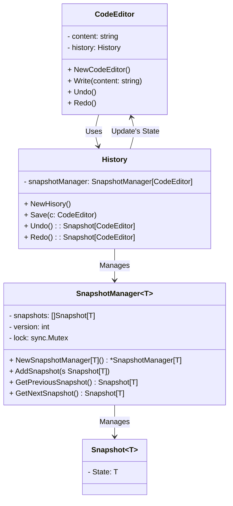
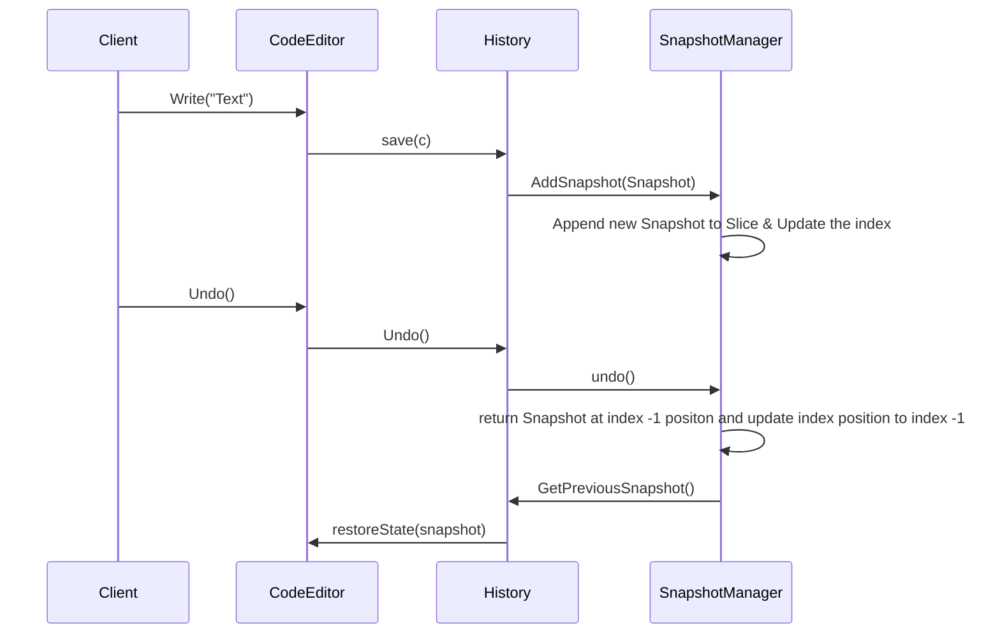

# Memento Design Pattern

## Overview

The Memento Design Pattern is a behavioral design pattern that allows an object to capture its internal state and later restore it to that state without exposing its internal structure. It is useful when you need to implement features like undo/redo functionality or maintain a history of an object's state.

## Why Use This Pattern?

The Memento pattern offers several benefits:

- **State Preservation**: It allows you to save an object's state at a particular point in time and restore it later, preserving its history.

- **Encapsulation**: The pattern encapsulates an object's state, preventing direct access and modification, thus promoting information hiding.

- **Undo/Redo**: It's ideal for implementing undo and redo functionality in applications.

- **Snapshot Management**: You can manage snapshots of an object's state efficiently, enabling version control.

## When to Use This Pattern

You should consider using the Memento pattern when:

- You need to save and restore an object's state, such as in undo/redo functionality.

- You want to encapsulate an object's state to ensure that it cannot be modified directly.

- There is a need to maintain a history of an object's state for auditing or version control.

## How to Use This Pattern

To implement the Memento pattern in Go, follow these steps:

1. Create a `Memento` struct to represent the saved state. This struct should be generic using the `any` constraint.

2. Create a `Caretaker` (in this case, `SnapshotManager`) to manage the snapshots (mementos).

3. In the originator (the object whose state you want to save), provide methods to create snapshots and restore state from snapshots.

## Implementation Details

In the provided Go code, the Memento pattern is implemented using generics:

- `Snapshot[T]` represents a saved state, where `T` is the type of the object being saved.

- `SnapshotManager[T]` manages the snapshots and allows you to add, undo, and redo snapshots.

- `History` is a specific implementation for a code editor, managing snapshots of `CodeEditor` instances.

- `CodeEditor` is the originator that can save and restore its state.

## Class Diagram

## Sequence Diagram

## Applicability and Use Cases

The Memento pattern is applicable in various scenarios:

1. **Text Editors**: To implement undo/redo functionality for text editors.

2. **Graphics Software**: For saving and restoring the state of graphic objects, allowing users to undo changes.

3. **Game Development**: For managing the state of game characters and levels, enabling the player to revert to previous states.

4. **Configuration Management**: To manage the state of configuration settings in applications.

5. **Transactional Systems**: In databases or financial systems, to roll back to previous transaction states in case of errors.

6. **Collaborative Editing**: In collaborative document editing tools, to track and restore document history.

7. **Version Control Systems**: To capture and restore different versions of source code or documents.

8. **Workflow Management**: To handle the state of workflows and tasks in business process management.

## Relation with Other Patterns

The Memento pattern can be combined with other design patterns to enhance functionality:

1. **Command Pattern**: Memento can work with the Command pattern to save and restore the state of commands, supporting undo and redo of commands.

2. **State Pattern**: Memento can be used with the State pattern to save and restore the state of objects in a flexible and maintainable way.

3. **Iterator Pattern**: In some cases, Memento can be used to save and restore the state of iterators, allowing you to resume iteration from a specific point.

4. **Decorator Pattern**: You can use Memento with the Decorator pattern to capture and restore the state of decorated objects.

5. **Observer Pattern**: Memento can be observed to track changes in an object's state and create snapshots when significant changes occur.

6. **Prototype Pattern**: Memento can be used to create deep copies (clones) of objects along with their state, allowing you to restore objects to previous states without affecting the current state.
