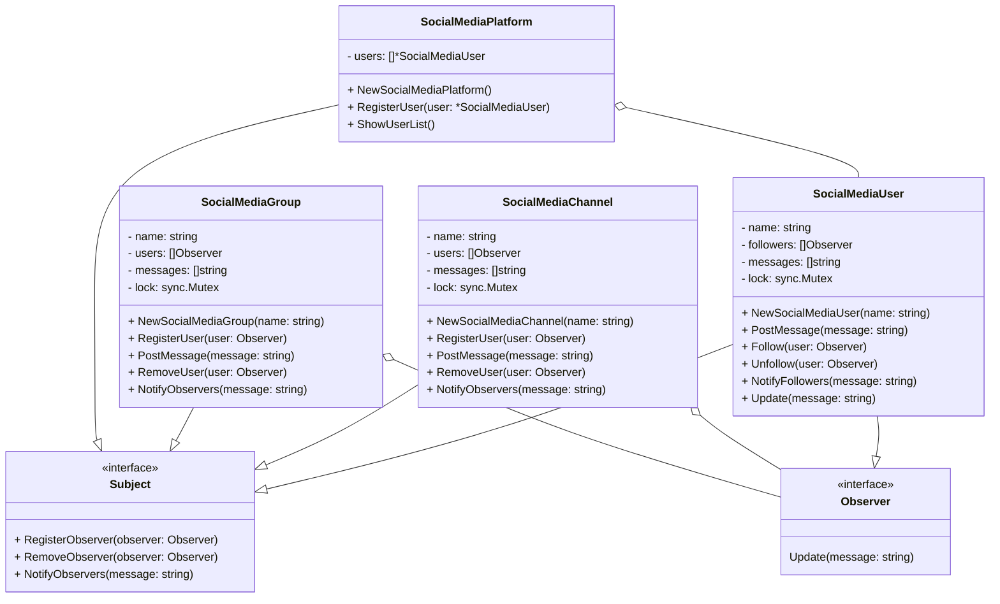
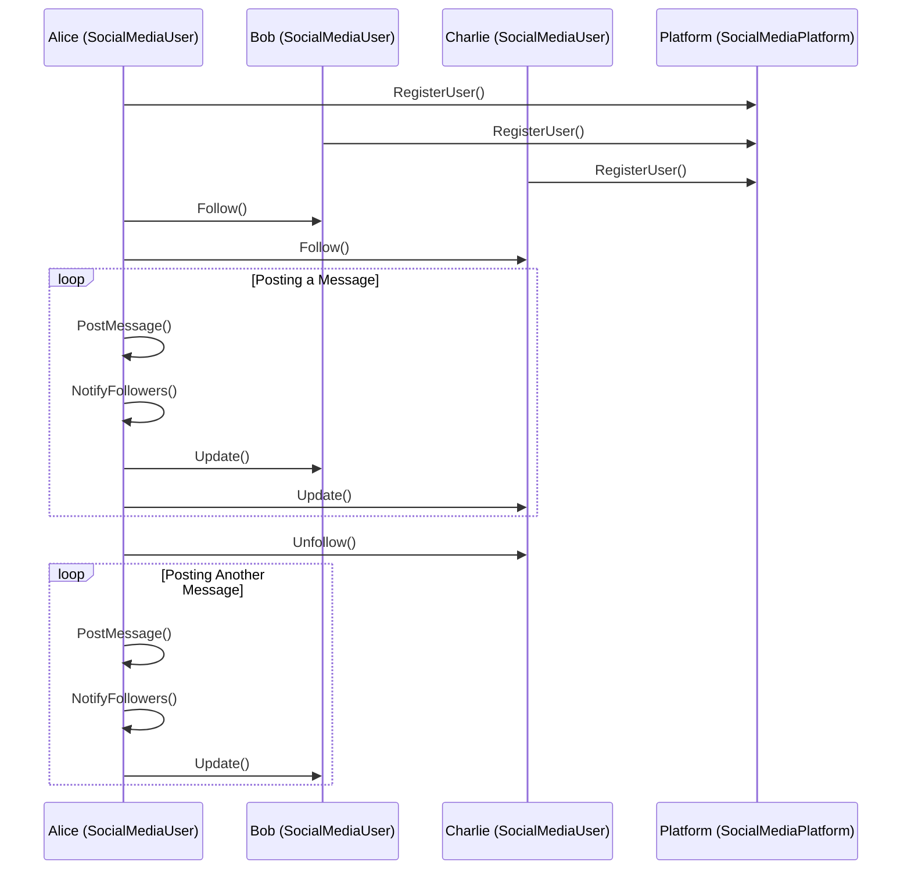

I apologize for the oversight. Let's format the documentation for the Observer Design Pattern in accordance with your specifications:

# Observer Design Pattern

## Overview

The Observer Design Pattern is a behavioral design pattern that defines a one-to-many dependency between objects so that when one object changes state, all its dependents are notified and updated automatically. It's used to create a distributed system of objects where a subject (observable) maintains a list of its dependents (observers) and notifies them of state changes.

## Why Use This Pattern?

The Observer pattern offers several benefits:

- **Decoupling**: It decouples the subject (publisher) from its observers (subscribers), allowing them to vary independently.

- **Flexibility**: New observers can be added or removed without modifying the subject, making the system more extensible.

- **Event Handling**: It's ideal for implementing event handling systems, where multiple objects need to react to changes in a subject.

- **Loose Coupling**: It promotes loose coupling between objects, as the subject doesn't need to know the concrete classes of its observers.

## When to Use This Pattern

You should consider using the Observer pattern when:

- One object (the subject) needs to notify multiple objects (observers) about changes in its state.

- You want to implement event handling systems, where events trigger actions in multiple parts of the system.

- Objects should be able to subscribe and unsubscribe from updates independently.

## How to Use This Pattern

To implement the Observer pattern in Go, follow these steps:

1. Define an `Observer` interface with an `Update` method that the concrete observers will implement. The `Update` method is called when the subject's state changes.

2. Define a `Subject` interface with methods to register, remove, and notify observers. The subject should maintain a list of registered observers.

3. Implement a concrete subject (e.g., `SocialMediaUser`) that holds the state and notifies observers when changes occur.

4. Implement concrete observers (e.g., other `SocialMediaUser` instances) that implement the `Update` method to respond to state changes.

## Implementation Details

In the provided Go code, the Observer pattern is implemented as follows:

- `Observer` and `Subject` interfaces define the contracts for observers and subjects.

- `SocialMediaUser` represents a concrete subject that can post messages and be followed by other users. It notifies its followers when a message is posted.

- `SocialMediaChannel` and `SocialMediaGroup` are additional concrete implementations of the `Subject` interface, representing channels and groups that users can join and post messages to.

## Class Diagram

## Sequence Diagram

The class diagram shows the relationships between the `SocialMediaUser`, `SocialMediaChannel`, `SocialMediaGroup`, `Observer`, and `Subject` interfaces and their implementations.

## Applicability and Use Cases

The Observer pattern is applicable in various scenarios:

1. **Event Handling**: Implementing event-driven systems where events can have multiple subscribers.

2. **UI Components**: Updating UI elements when underlying data changes.

3. **Stock Market**: Notifying investors about changes in stock prices.

4. **Chat Applications**: Updating chat messages in real-time for multiple users.

5. **Distributed Systems**: Distributing state changes across multiple components.

6. **Logging**: Logging systems where log entries are sent to multiple destinations.

7. **Monitoring**: Monitoring systems where sensors or data sources trigger alarms.

## Relation with Other Patterns

The Observer pattern can be combined with other design patterns to enhance functionality:

1. **Singleton Pattern**: The Singleton pattern can be used to implement the subject in a way that ensures there's only one source of events or notifications.

2. **Mediator Pattern**: The Mediator pattern can be used to centralize communication between observers and reduce direct dependencies between them.

3. **Factory Pattern**: The Factory pattern can be used to create observer objects dynamically and inject them into the subject.

4. **Command Pattern**: The Command pattern can be used to encapsulate the notifications sent by the subject, allowing for more complex handling of events.

These combinations can lead to more complex and powerful systems that leverage the Observer pattern's flexibility.
