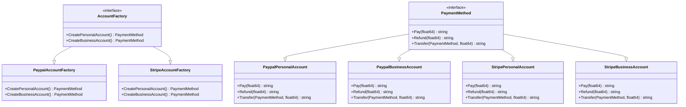

# Abstract Factory Pattern

## Introduction
This documentation provides an overview of an Abstract Factory pattern implemented for a Payment System in Go. The system is designed to handle two types of payment accounts: PayPal and Stripe, each having two subtypes: Personal and Business accounts.

## Architecture
The system is structured around two main interfaces:

- **AccountFactory**: An interface for creating different types of payment accounts.
- **PaymentMethod**: An interface defining various account operations like Pay, Refund, and Transfer.

There are two concrete implementations for AccountFactory:
- **PaypalAccountFactory**: Creates PayPal Personal and Business accounts.
- **StripeAccountFactory**: Creates Stripe Personal and Business accounts.
Each account type (PayPal or Stripe, Personal or Business) implements the PaymentMethod interface.

## Explanation
The AccountFactory interface provides methods to create Personal and Business accounts. The concrete implementations like PaypalAccountFactory and StripeAccountFactory implement these methods and return instances of accounts that implement the PaymentMethod interface. The PaymentMethod interface has methods for conducting payments, refunds, and transfers. Each concrete account type (Personal and Business for both PayPal and Stripe) implements these methods.