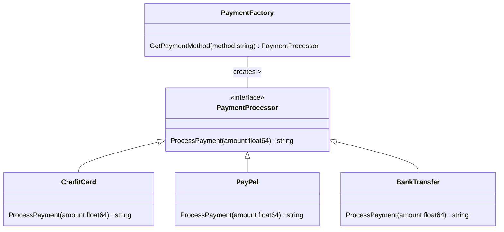
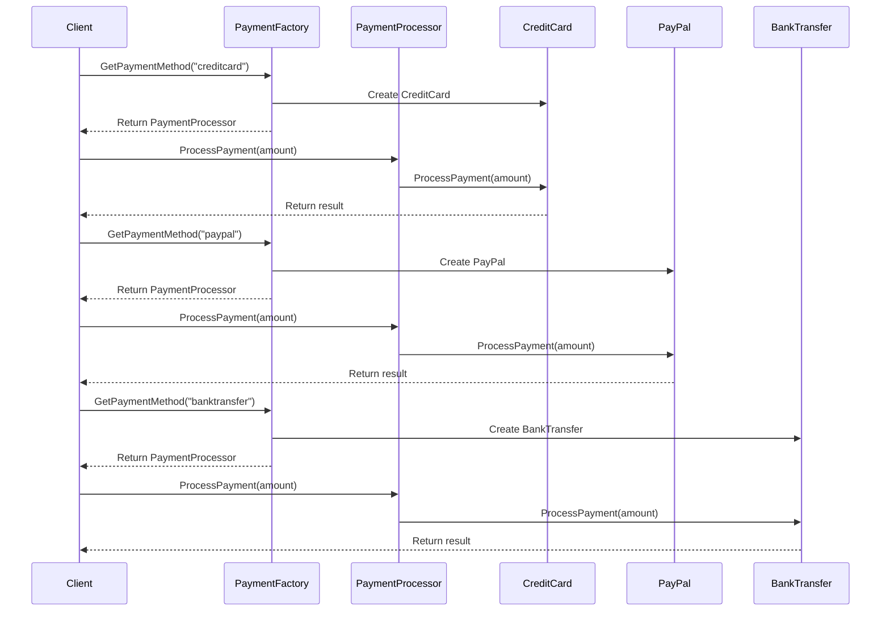

# Factory Design Pattern

```mermaid 
classDiagram
    class PaymentProcessor {
<<interface>>
ProcessPayment(amount float64) string
}
class CreditCard {
ProcessPayment(amount float64) string
}
class PayPal {
ProcessPayment(amount float64) string
}
class BankTransfer {
ProcessPayment(amount float64) string
}
class PaymentFactory {
GetPaymentMethod(method string) PaymentProcessor
}
PaymentProcessor <|-- CreditCard
PaymentProcessor <|-- PayPal
PaymentProcessor <|-- BankTransfer
PaymentFactory -- PaymentProcessor : creates >
```

```mermaid
sequenceDiagram
    participant Client
    participant PaymentFactory
    participant PaymentProcessor
    participant CreditCard
    participant PayPal
    participant BankTransfer

    Client->>PaymentFactory: GetPaymentMethod("creditcard")
    PaymentFactory->>CreditCard: Create CreditCard
    PaymentFactory-->>Client: Return PaymentProcessor
    Client->>PaymentProcessor: ProcessPayment(amount)
    PaymentProcessor->>CreditCard: ProcessPayment(amount)
    CreditCard-->>Client: Return result

    Client->>PaymentFactory: GetPaymentMethod("paypal")
    PaymentFactory->>PayPal: Create PayPal
    PaymentFactory-->>Client: Return PaymentProcessor
    Client->>PaymentProcessor: ProcessPayment(amount)
    PaymentProcessor->>PayPal: ProcessPayment(amount)
    PayPal-->>Client: Return result

    Client->>PaymentFactory: GetPaymentMethod("banktransfer")
    PaymentFactory->>BankTransfer: Create BankTransfer
    PaymentFactory-->>Client: Return PaymentProcessor
    Client->>PaymentProcessor: ProcessPayment(amount)
    PaymentProcessor->>BankTransfer: ProcessPayment(amount)
    BankTransfer-->>Client: Return result
```