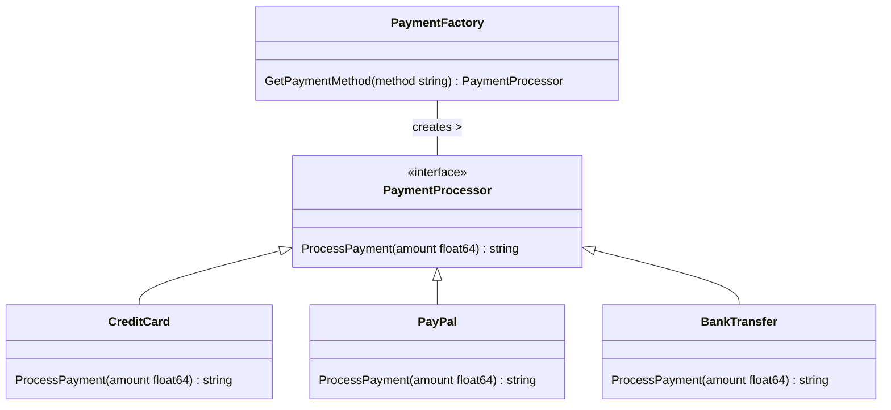
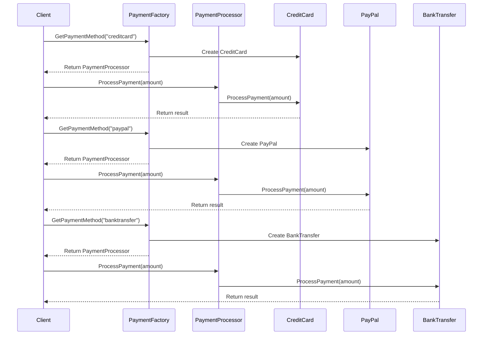

# Factory Design Pattern

## Introduction
This document provides a comprehensive explanation of a Factory Design Pattern implemented for a payment processing system. The factory pattern allows for creating objects without specifying the exact class of objects that will be created.

## Design Decisions
1. **Simplicity**: The Factory Pattern aims to simplify the client code by abstracting the object creation logic.
2. **Extensibility**: The design is open for extension. New payment methods can be added easily without modifying existing code.
3. **Polymorphism**: Leveraging polymorphism for implementing payment methods allows for uniform method calls, irrespective of the payment method type.

## Architecture Overview
The architecture consists of the following components:
1. **PaymentProcessor**: An interface outlining the method for processing payments.
2. **PaymentFactory**: A class responsible for creating instances of PaymentProcessor based on the method type.

