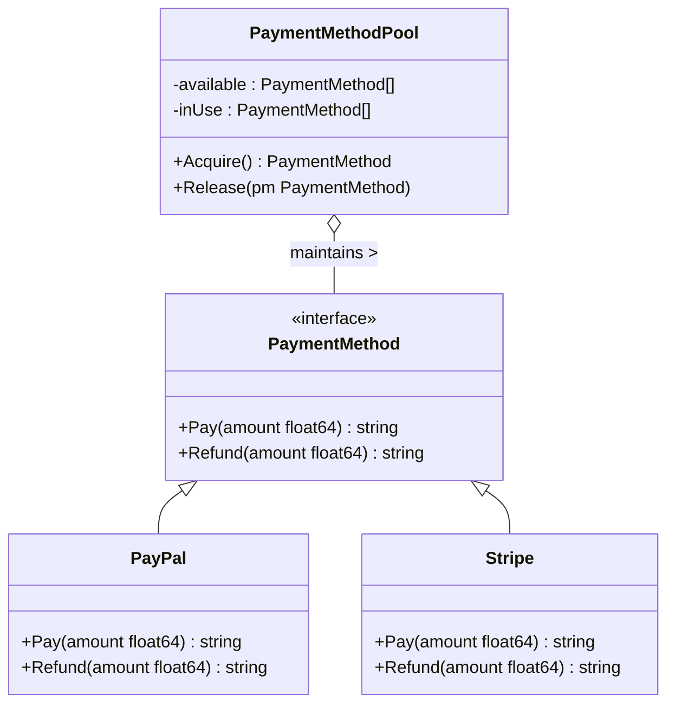
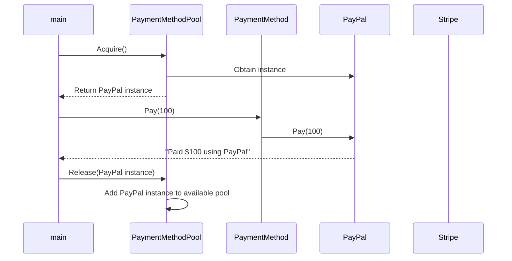

# Object Pool Pattern

## Introduction
The Object Pool Pattern aims to reuse objects that are expensive to instantiate or acquire, such as database connections or network sockets, thus improving  the system performance.

## Design decisions
1. **Resource Optimization**: The main driving factor behind employing the Object Pool Pattern is to minimize the resource consumption associated with object creation.
2. **Concurrency**: The Object Pool pattern allows for safe concurrent access to the pooled objects.
3. **Life Cycle Management**: The pattern also manages the life cycle of objects, making sure to clean up and recycle resources as necessary.

## Architecture Overview 
The Architecture consists of the following main components:
1. `PaymentMethod`: An interface that provides a blueprint for payment operations.
2. `PaymentMethodPool`: A struct that maintains a pool of `PaymentMethod` objects for reuse.
3. `Paypal` and `Stripe`: Concrete implementations of the `PaymentMethod` interface.

