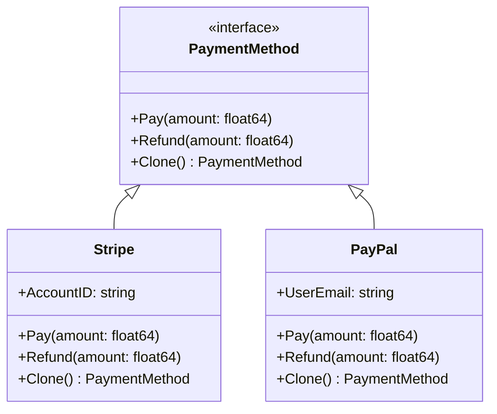
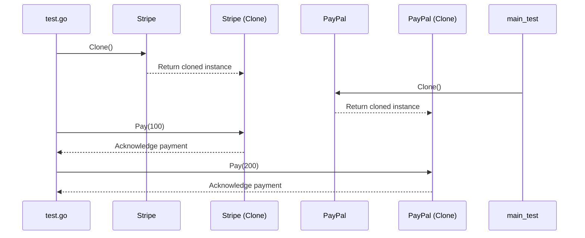

# Prototype Pattern

## Introduction
The Prototype design pattern enables the creation of new objects by cloning existing ones, thus reducing the computational overheads associated with instance creation in complex or resource-intensive system.

## Design decisions
1. **Performance**: One of the main reason for adopting the Prototype pattern is performance optimization. It's computationally less expensive to clone an object rather than creating a new instance.
2. **Flexibility**: The design provides great flexibility when dealing with objects that have numerous shared configurations.
3. **Encapsulation**: The internal state of existing instance can be reused  without exposing their representation.

## Architecture Overview
The Architecture consists of the following main components:

1. `PaymentMethod` : This is an interface that outlines the methods that the concrete implementations must provide.
2. `Paypal` and `Stripe` : These are concrete classes that implement the  `PaymentMethod` interface, including a `Clone` method for producing copies of themselves. 

**Key Points to Understand**
- **Object Independence**: Even though StripeClone and PayPalClone are created based on existing objects, they are fully independent. Any actions performed on them do not impact the original objects.
- **Efficiency and Resource Optimization**: Creating new instances by cloning existing ones often tends to be more resource-efficient compared to constructing a new object from scratch, especially when the object construction process is complex.
- **Maintainability**: The Prototype pattern ensures that each class adheres to the Single Responsibility Principle. It does one thing: cloning itself. This separation of concerns makes the system easier to understand and maintain.
- **Flexibility**: The Prototype pattern can accommodate any object that adheres to the PaymentMethod interface, making it incredibly flexible and extendable for future payment methods.