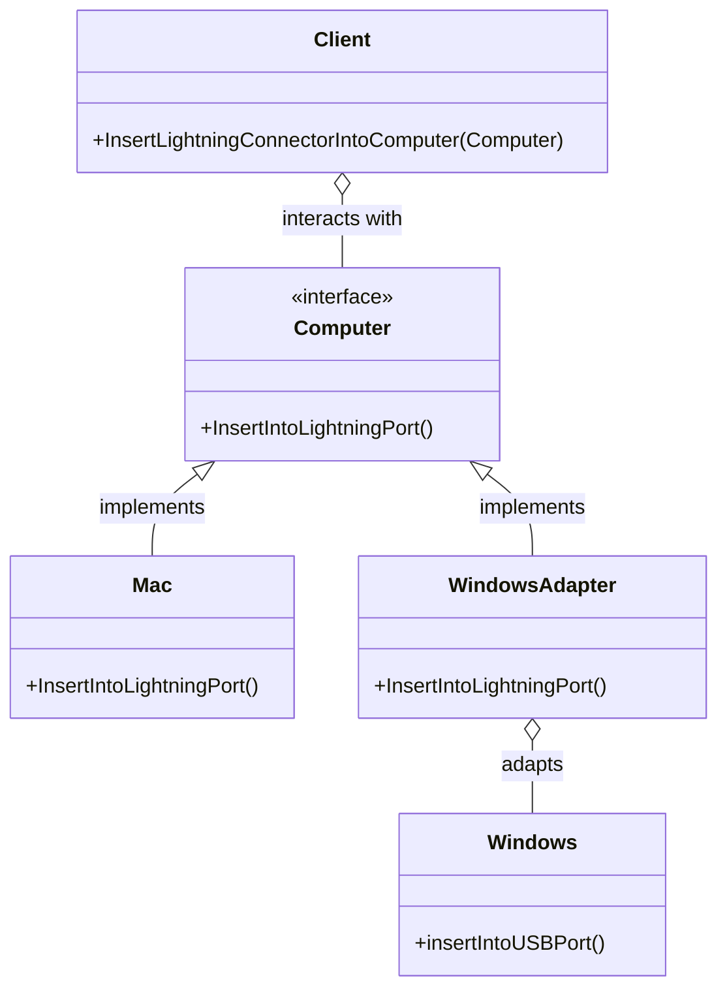
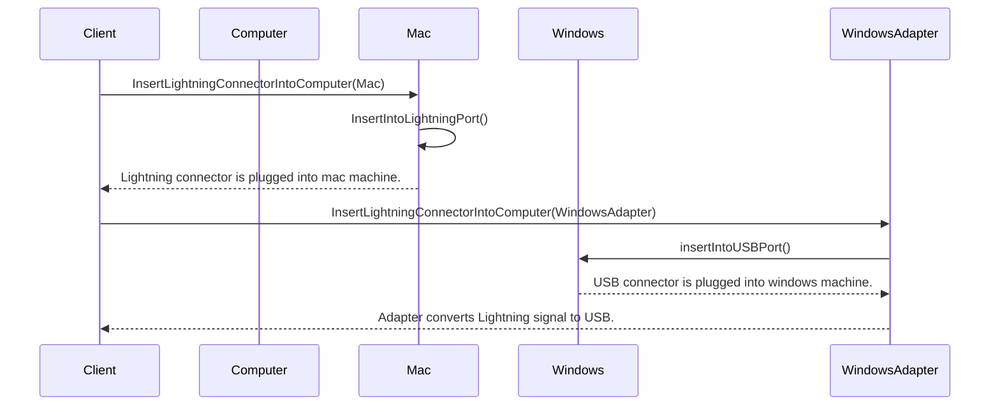

```mermaid
classDiagram
    Computer <|-- Mac : implements
    Computer <|-- WindowsAdapter : implements
    Client o-- Computer : interacts with
    WindowsAdapter o-- Windows : adapts

    class Client {
        +InsertLightningConnectorIntoComputer(Computer)
    }

class Computer {
    <<interface>>
+InsertIntoLightningPort()
}

class Mac {
+InsertIntoLightningPort()
}

class Windows {
+insertIntoUSBPort()
}

class WindowsAdapter {
+InsertIntoLightningPort()
}

```

```mermaid
sequenceDiagram
    participant C as Client
    participant Co as Computer
    participant M as Mac
    participant W as Windows
    participant WA as WindowsAdapter

    C->>M: InsertLightningConnectorIntoComputer(Mac)
    M->>M: InsertIntoLightningPort()
    M-->>C: Lightning connector is plugged into mac machine.

    C->>WA: InsertLightningConnectorIntoComputer(WindowsAdapter)
    WA->>W: insertIntoUSBPort()
    W-->>WA: USB connector is plugged into windows machine.
    WA-->>C: Adapter converts Lightning signal to USB.

```