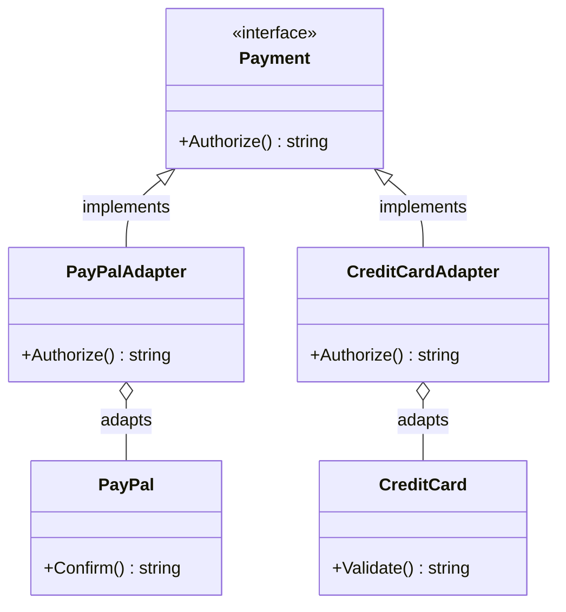
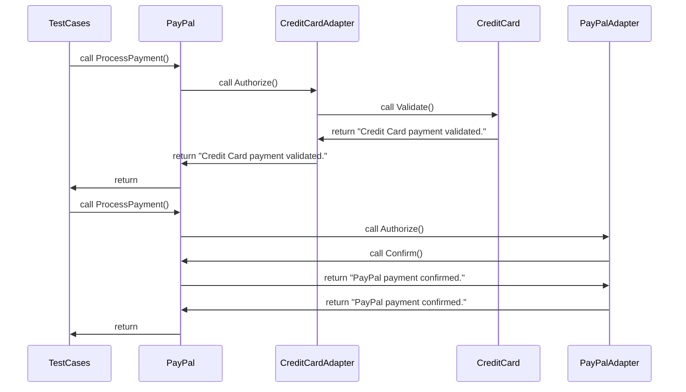

# Adapter Pattern

## Architecture 
The architecture primarily consists of the following components:
1. `Payment` : THe target interface to standardise payment authorization.
2. `CredtCard` and `Paypal` : The adaptees which contains different APIs for processing payment.
3. `CredtCardAdapter` and `PaypalAdapter` : The adapters that make `CreditCard` and `Paypal` conform to the Payment interface.

## Concept
The Adapter Pattern allows classes with incompatible interfaces to work together. In this example, we  have two different payment systems(`CreditCard` and `Paypal`) with their APIs (`Validate()` and `Confirm()`).The `Adapter` struct (`CreditCardAdapter` and `PaypalAdapter`) make these different systems compatible with a common interface `Payment`. 

