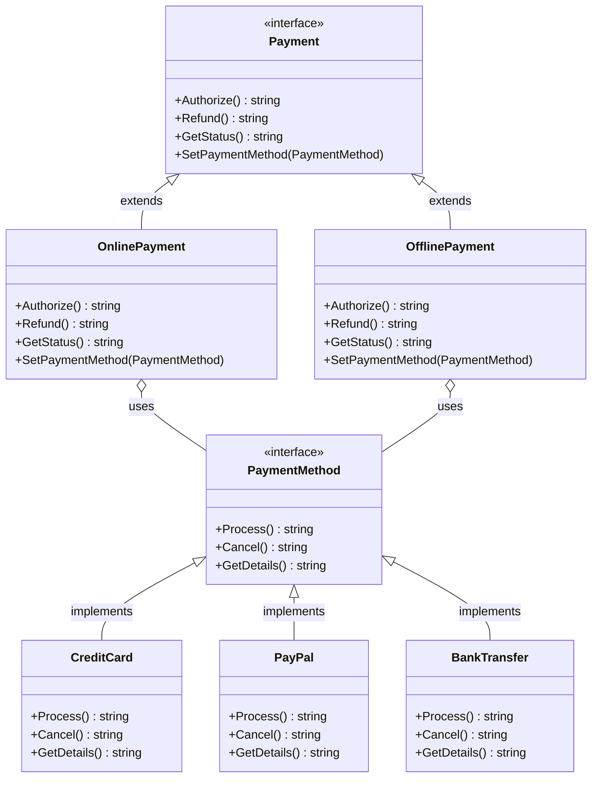
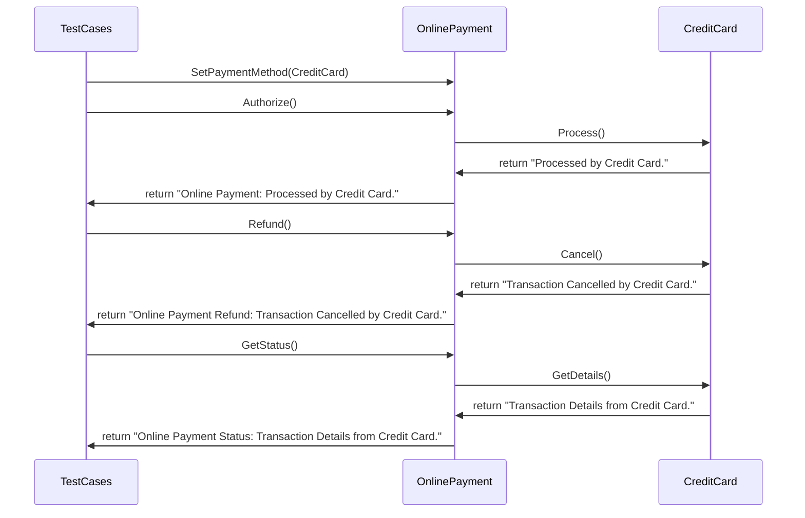

# Bridge Pattern

**Architecture Overview**
1. **Abstraction** (`Payment`): Adds features like `Refund()` and `GetStatus()`.
2. **Implementor** (`PaymentMethod`): Adds methods like `Cancel()` and `GetDetails()`.
3. **RefinedAbstraction** (`OnlinePayment`, `OfflinePayment`): Introduce additional types of online and offline payments.
4. **ConcreteImplementor** (`CreditCard`, `PayPal`, `BankTransfer`): Adds more payment methods.

**Explanation**
The current architecture makes it very easy to add new payment methods like stripe, paypal, upi etc. Also, this follows the segregation of principles as the `Payment` interface is not bloated with the methods of `PaymentMethod` interface.