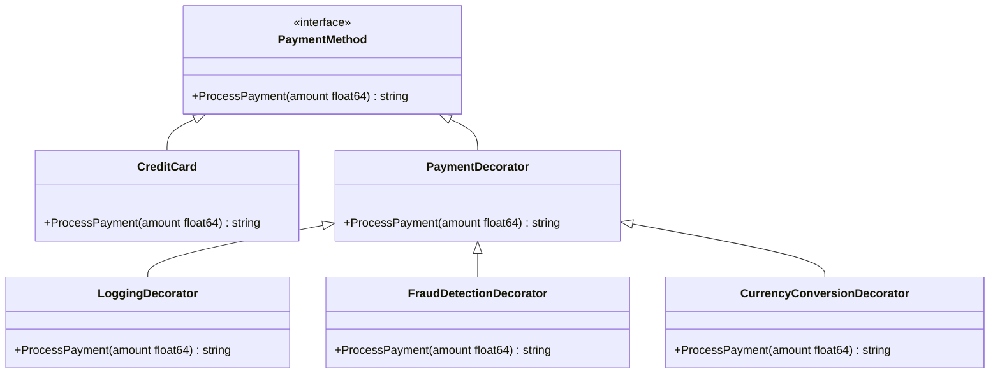
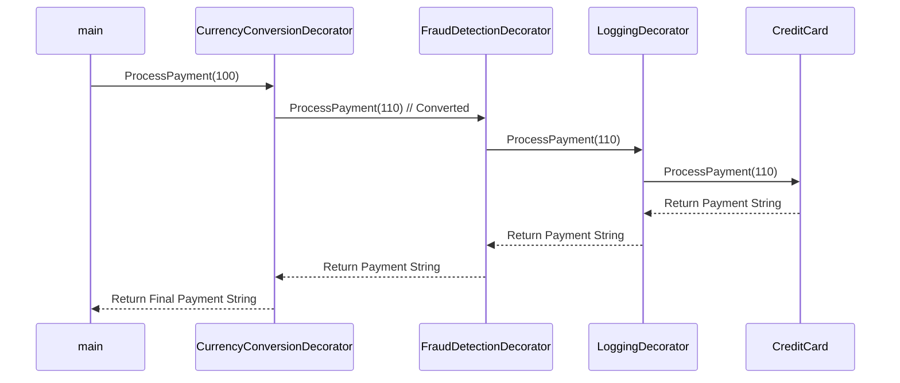

# Decorator Pattern

**Architecture Overview**
1. PaymentMethod (interface): Defines the interface for all concrete classes to comply.
2. CreditCard (struct): A concrete implementation of the PaymentMethod interface.
3. PaymentDecorator (struct): Implements the PaymentMethod interface and keeps a reference to a wrapped PaymentMethod object.
4. LoggingDecorator (struct): Logs all payment attempts.
5. FraudDetectionDecorator (struct): Checks for fraud in payments.
6. CurrencyConversionDecorator (struct): Converts payment amount to a different currency. 

**File Structure**
1. **payment_method.go:** Defines the PaymentMethod interface.
2. **credit_card.go:** Implements the credit card payment method.
3. **payment_decorator.go:** Base decorator.
4. **logging_decorator.go:** Logs payment information.
5. **fraud_detection_decorator.go:** Implements fraud detection.
6. **currency_conversion_decorator.go:** Implements currency conversion.
7. **payment_test.go:** Test cases using the assert library.

### Class Diagram

### Sequence Diagram
