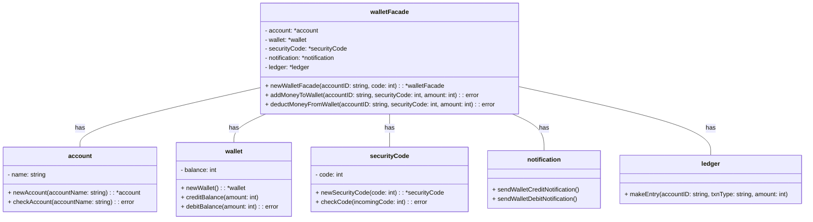
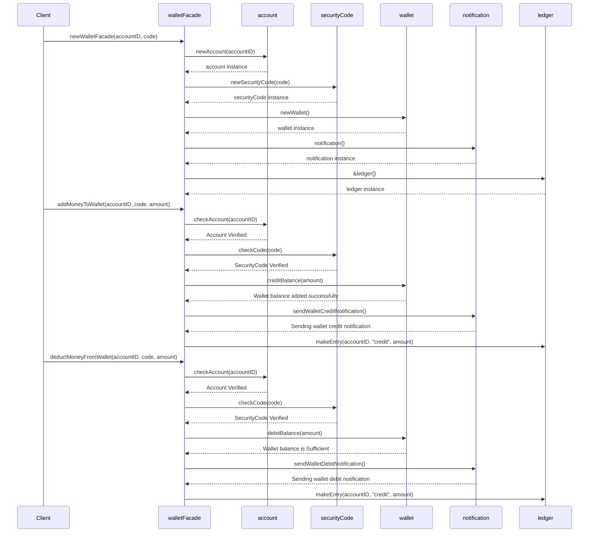

# Facade Pattern

## Class Diagram

```mermaid
classDiagram
    class walletFacade {
        - account: *account
        - wallet: *wallet
        - securityCode: *securityCode
        - notification: *notification
        - ledger: *ledger
        + newWalletFacade(accountID: string, code: int): *walletFacade
        + addMoneyToWallet(accountID: string, securityCode: int, amount: int): error
        + deductMoneyFromWallet(accountID: string, securityCode: int, amount: int): error
    }

    class account {
        - name: string
        + newAccount(accountName: string): *account
        + checkAccount(accountName: string): error
    }

    class securityCode {
        - code: int
        + newSecurityCode(code: int): *securityCode
        + checkCode(incomingCode: int): error
    }

    class wallet {
        - balance: int
        + newWallet(): *wallet
        + creditBalance(amount: int)
        + debitBalance(amount: int): error
    }

    class ledger {
        + makeEntry(accountID: string, txnType: string, amount: int)
    }

    class notification {
        + sendWalletCreditNotification()
        + sendWalletDebitNotification()
    }

    walletFacade -- account : has
    walletFacade -- wallet : has
    walletFacade -- securityCode : has
    walletFacade -- notification : has
    walletFacade -- ledger : has
```

## Sequence Diagram

```mermaid
sequenceDiagram
    participant client as Client
    participant facade as walletFacade
    participant account as account
    participant code as securityCode
    participant wallet as wallet
    participant notification as notification
    participant ledger as ledger

    client ->> facade: newWalletFacade(accountID, code)
    facade ->> account: newAccount(accountID)
    account -->> facade: account instance
    facade ->> code: newSecurityCode(code)
    code -->> facade: securityCode instance
    facade ->> wallet: newWallet()
    wallet -->> facade: wallet instance
    facade ->> notification: notification{}
    notification -->> facade: notification instance
    facade ->> ledger: &ledger{}
    ledger -->> facade: ledger instance

    client ->> facade: addMoneyToWallet(accountID, code, amount)
    facade ->> account: checkAccount(accountID)
    account -->> facade: Account Verified
    facade ->> code: checkCode(code)
    code -->> facade: SecurityCode Verified
    facade ->> wallet: creditBalance(amount)
    wallet -->> facade: Wallet balance added successfully
    facade ->> notification: sendWalletCreditNotification()
    notification -->> facade: Sending wallet credit notification
    facade ->> ledger: makeEntry(accountID, "credit", amount)

    client ->> facade: deductMoneyFromWallet(accountID, code, amount)
    facade ->> account: checkAccount(accountID)
    account -->> facade: Account Verified
    facade ->> code: checkCode(code)
    code -->> facade: SecurityCode Verified
    facade ->> wallet: debitBalance(amount)
    wallet -->> facade: Wallet balance is Sufficient
    facade ->> notification: sendWalletDebitNotification()
    notification -->> facade: Sending wallet debit notification
    facade ->> ledger: makeEntry(accountID, "credit", amount)
```