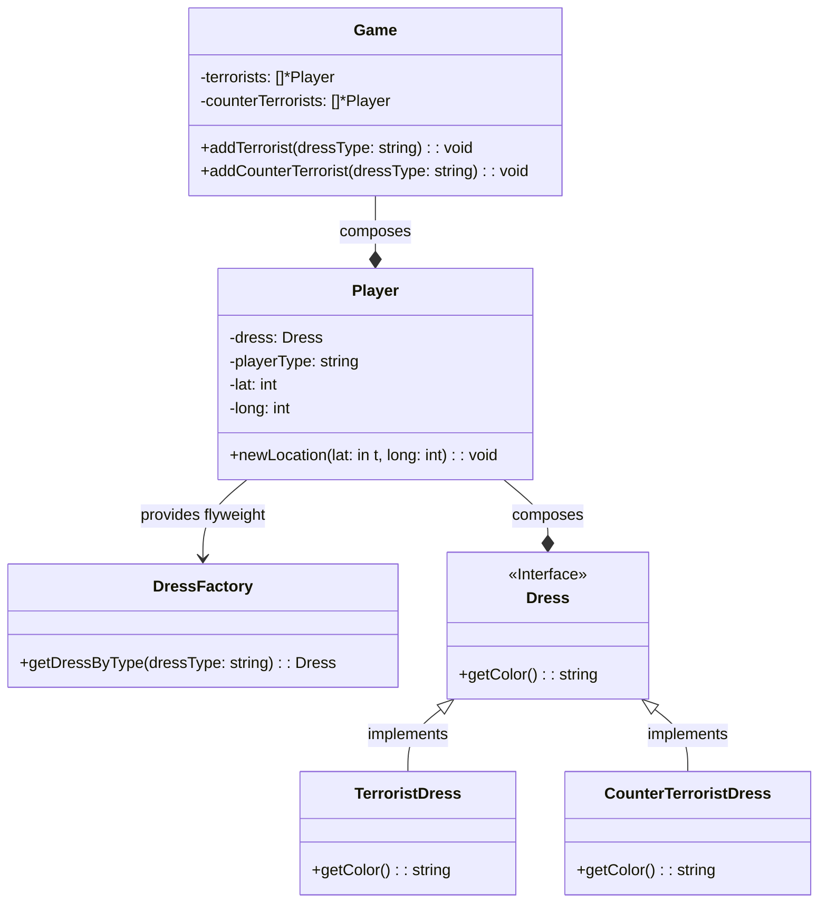
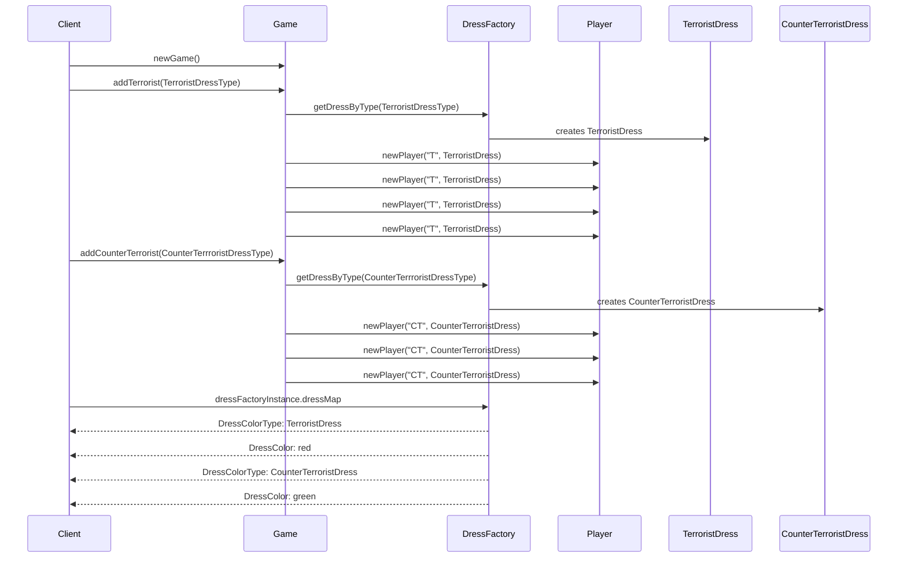

# Flyweight Pattern

Flyweight enables you fit more objects in available amount of RAM memory by sharing the common part of the state between multiple objects instead of keeping all of the data in each object.

## Objective

1. **Minimize the Memory Usage:** The primary goal is to reduce the memory footprint of an application. This is especially important when dealing with a large number of obejcts that share a significant portion of their state.
2. **Improve Performance:** By sharing common state among multiple objects, the Flyweight pattern can improve the performance of an application. It reduces the overhead assciated with the creation and managing a large number of similar objects.
3. **Promote Reusability:** Flyweight promotes the reuse of existing object. Instead of creating new objects for every similar context, it encourages the use of shared objects.
4. **Simplify Object Creation:** It simplifies the creation of objects by separating intrinsic state(shared) from extrinsic state(context-dependent). Intrinsic state is stored in shared flyweight objects, while extrinsic state is supplied externally when needed.
5. **Enhance Scalability:** Flyweight pattern are particularly usefull in scenarios where an application needs to scale up to handle a large number of objects efficiently.

## Application

- When an application needs to spawn a huge number of similar objects.
- Objects contains duplicate state which can be extracted and shared between mulitple objects

## Implementation

- **Identify Intrisic and Extrinsic State:** Carefully identify the intrinsic(shared) and extrinsicA(unique) state of your objects. The intrinsic state should be common among multiple objects and can be shared, while the extrinsic state should be separate for each object.
- **Create Flyweight Objects:** Define a set of flyweight objects that represents the intrinsic state. These objects should be immutable, ensuring that their state cannot be modified once created.
- **Create a Flyweight Factory:** Implement a factory(Flyweight Factory) responsible for creating and manging flyweight objects. The factory should maintain a pool or cache of flyweight objects for efficient reuse.
- **Client Code:** In your client code, whenyou need an object, use the Flyweight Factory to obtain or create the flyweight objects. Provide the extrinsic state to the flyweight objects as needed.
- **Minimize Object Creation:** Ensure that you minimize the creation of new objects and reuse existing flyweight objects whenever possible. This reduces memory usage and improves performance.
- **Thread Safety:** Consider thread safety if your application is multi-threadded. Ensure that flyweight objects are accessed and modified in a thread safe manner.
- **Use Immutable Objects:** Make flyweight objects immutable to prevent unintended changes to their state. This ensures that the instrinsic state remains consistent across all references.
- **Caching:** Implement efficient caching mechanisms to store and retrieve flyweigth objects. Use techniques like object pooling to minimize the overhead of object creation.
- **Testing and Profiling:** Throughly measure your implementation and measure memory usage and performance. Optimize as needed based on real-world usage pattern.

### Class Diagram

**Explanation**

- As the `Dress` will be the same between the players of same teams, so the flyweight for `Dress` is created using the DressFactory.
- This enables to reuse the same `Dress` object among all the members of a team.
- So if a team consist of 100 players, with the use of flyweight only one object of `Dress` will be created for all team members instead of 100 objects that would have been created in normal scenario(all the team members will share same `Dress` object).

### Sequence Diagram

